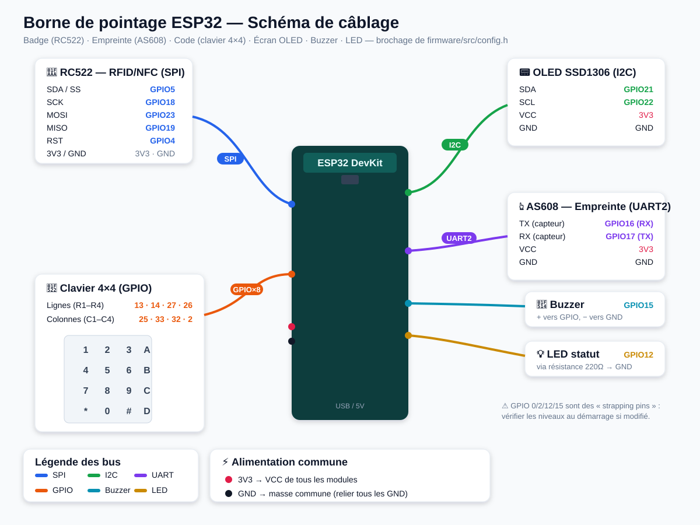

# Firmware borne ESP32 — Pointage SN

Borne de pointage multi-méthodes pour ESP32, pensée pour un fonctionnement
**24h/24** :

- 🪪 **Badge RFID/NFC** — lecteur **RC522**
- 👆 **Empreinte digitale** — capteur **AS608 / R307**
- 🔢 **Code PIN** — clavier matriciel **4×4**
- 📟 Retour utilisateur : écran **OLED SSD1306**, buzzer, LED de statut
- 🔁 Reconnexion WiFi, resynchronisation **NTP**, **watchdog** matériel
- 💾 **File d'attente hors-ligne** persistante (LittleFS) : aucun pointage perdu
  en cas de coupure réseau, renvoi automatique au retour de la connexion
- 💓 **Heartbeat** périodique pour la supervision côté serveur

> La **reconnaissance faciale** (FaceID) reste gérée par la borne web
> (navigateur), l'embedding facial n'étant pas réalisable sur ESP32.

## Matériel

| Composant | Modèle | Bus |
|-----------|--------|-----|
| Carte | ESP32 DevKit v1 | — |
| RFID | MFRC522 | SPI |
| Empreinte | AS608 / R307 | UART2 |
| Clavier | Matriciel 4×4 | GPIO |
| Écran | OLED SSD1306 128×64 | I2C |

## Schéma de câblage



> Illustration : [`docs/wiring-esp32.svg`](docs/wiring-esp32.svg)

## Conception électronique (schéma + netlist + BOM)

- 📐 **Schéma électronique** (symboles + labels de net, style KiCad) :
  [`docs/schematic-esp32.svg`](docs/schematic-esp32.svg)
- 🔗 **Netlist KiCad** (connectivité complète, importable) :
  [`docs/pointage-esp32.net`](docs/pointage-esp32.net)
- 🧾 **Nomenclature (BOM)** : [`docs/BOM.md`](docs/BOM.md) ·
  [`docs/BOM.csv`](docs/BOM.csv)

> Pour recréer le projet dans **KiCad** : créer le schéma en plaçant les mêmes
> *Global Labels*, ou importer le netlist dans Pcbnew après association des
> empreintes. Dans **Fritzing**, reproduire le schéma à partir de
> `schematic-esp32.svg`. (Les binaires `.kicad_sch` / `.fzz` ne peuvent pas
> être générés automatiquement ici.)

## Câblage (brochage par défaut, voir `src/config.h`)

**RC522 (SPI)** : SDA/SS→GPIO5, SCK→18, MOSI→23, MISO→19, RST→4, 3V3, GND
**AS608 (UART2)** : capteur TX→GPIO16, capteur RX→GPIO17, 3V3, GND
**OLED (I2C)** : SDA→GPIO21, SCL→GPIO22, 3V3, GND
**Clavier 4×4** : lignes→{13,14,27,26}, colonnes→{25,33,32,2}
**Buzzer**→GPIO15, **LED statut**→GPIO12

> ⚠️ GPIO 0/2/12/15 sont des *strapping pins*. Le brochage proposé fonctionne
> mais vérifiez les niveaux au démarrage si vous le modifiez.

## Configuration

Éditez `src/config.h` :

1. `WIFI_SSID` / `WIFI_PASSWORD`
2. `API_BASE_URL` (ex. `http://192.168.1.10:3001/api`)
3. `DEVICE_ID` et `DEVICE_KEY` — obtenus en créant une **Borne** dans
   l'interface web (menu *Bornes*). La clé n'est affichée qu'une seule fois.
4. `DEFAULT_DIRECTION` : `""` (auto), `"IN"` ou `"OUT"`.

## Compilation & flash (PlatformIO)

```bash
cd firmware
pio run                 # compiler
pio run -t upload       # flasher l'ESP32
pio device monitor      # console série (115200 bauds)
```

## Utilisation

- **Badge** : présenter le badge devant le lecteur.
- **Empreinte** : poser le doigt sur le capteur.
- **Code** : taper le PIN puis `#` (`*` pour effacer).
- **Enrôler une empreinte** : touche `A`, saisir un ID (1–127) puis `#`,
  suivre les instructions à l'écran. Lier ensuite cet ID à une personne dans
  l'interface web (champ *ID empreinte*).

## Lien avec le backend

| Action | Requête |
|--------|---------|
| Pointage | `POST /api/attendance/device` |
| Heartbeat | `POST /api/devices/heartbeat` |

En-têtes d'authentification : `X-Device-Id` et `X-Device-Key`.

Corps d'un pointage :
```json
{ "method": "BADGE", "identifier": "04A2B3C4" }
{ "method": "CODE", "identifier": "1234" }
{ "method": "FINGERPRINT", "fingerprintId": 7 }
```

> Pour le **HTTPS**, remplacez `HTTPClient` par un `WiFiClientSecure` avec le
> certificat racine de votre serveur.
