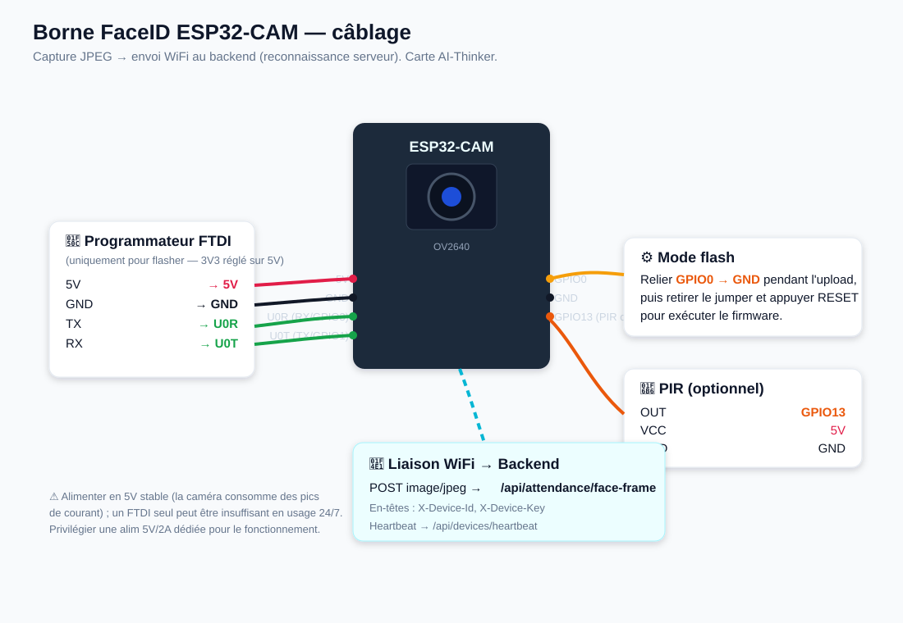

# Borne FaceID ESP32-CAM

Borne de pointage par **reconnaissance faciale** basée sur un **ESP32-CAM**
(AI-Thinker). La caméra capture des images JPEG et les envoie au backend, qui
réalise la reconnaissance **côté serveur** (`POST /api/attendance/face-frame`).

## Pourquoi côté serveur ?
L'ESP32-CAM n'a pas la puissance de calculer un descripteur facial 128-D fiable.
Il se contente donc de **capturer et transmettre** l'image ; le backend
(NestJS + @vladmandic/face-api) identifie la personne et enregistre le pointage.

## Pré-requis backend
Installer les dépendances optionnelles et les modèles serveur :

```bash
cd backend
npm install            # installe aussi tfjs-node / face-api / canvas si possible
npm run download-face-models
```

> Si ces dépendances ne sont pas installées, l'endpoint renvoie `503` et la
> borne l'indique sur la console série — le reste du système continue de
> fonctionner.

## Configuration
Éditer `src/config.h` : WiFi, `API_BASE_URL`, `DEVICE_ID` / `DEVICE_KEY`
(créés dans l'interface web > *Bornes*). Le module rattaché à la borne
détermine les personnes comparées.

## Schéma de câblage



> Illustration : [`../docs/wiring-esp32cam.svg`](../docs/wiring-esp32cam.svg)

## Flash (PlatformIO)
```bash
cd firmware/esp32cam
pio run -t upload
pio device monitor
```

## Fonctionnement
- Capture périodique (`CAPTURE_INTERVAL_MS`), ou sur détection PIR si `PIR_PIN`
  est défini.
- Pause après un pointage réussi (`COOLDOWN_AFTER_OK_MS`) pour éviter les
  doublons.
- Heartbeat + watchdog + reconnexion WiFi pour un fonctionnement 24h/24.

## Anti-spoofing
La détection de vivacité (clignement / mouvement) est assurée par la **borne
web**. Côté serveur sur une image unique, la vivacité ne peut être garantie :
pour un ESP32-CAM en environnement sensible, prévoir une caméra de profondeur
ou une analyse multi-trames dédiée.
